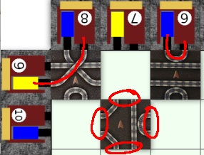
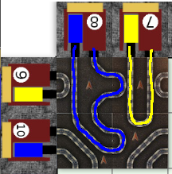
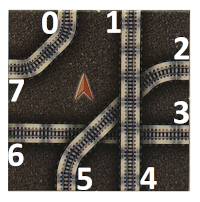
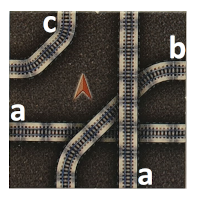
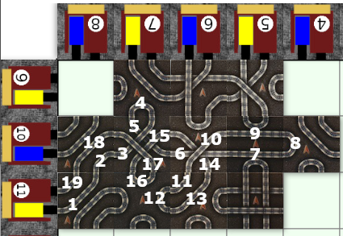

# COMP1110 Assignment 2 S1 2020 - Metro

## Academic Honesty and Integrity

Honesty and integrity are of utmost importance.
These goals are *not* at odds with being resourceful and working collaboratively.
You *should* be resourceful, you should collaborate within your team, and you should discuss the assignment and other aspects of the course with others taking the class.
However, *you must never misrepresent the work of others as your own*.
If you have taken ideas from elsewhere or used code sourced from elsewhere, you must say so with *utmost clarity*.
At each stage of the assignment you will be asked to submit a statement of originality, either as a group or as individuals.
This statement is the place for you to declare which ideas or code contained in your submission were sourced from elsewhere.

Please read the ANU's [official position](http://academichonesty.anu.edu.au/) on academic honesty.
If you have any questions, please ask me.

Carefully review the [statement of originality](originality.md) which you must complete.
Edit that statement and update it as you complete each state of the assignment, ensuring that when you complete each stage, a truthful statement is committed and pushed to your repo.

## Purpose

In this assignment you will exercise a number of major themes of the course, including software design and implementation,
using development tools such as Git and IntelliJ, using JavaFX to build a user interface.
As an extension task, you may also explore strategies for writing agents that play games.
Above all, this assignment will emphasize group work.

## Assignment Deliverables

The assignment is worth 30% of your total assessment, and it will be marked out of 30.
So each mark in the assignment corresponds to a mark in your final assessment for the course.
Note that for some stages of the assignment you will get a _group_ mark, and for others you will be _individually_ marked.
The mark breakdown and the due dates are described on the [deliverables](https://cs.anu.edu.au/courses/comp1110/assessments/deliverables/) page.

Your work will be marked by your tutor against the work you push to GitLab, so it is essential that you carefully follow instructions for setting up and maintaining your group repository.
At each deadline you will be marked according to whatever is pushed to GitLab at the time of the deadline.
You will be assessed on how effectively you use Git as a development tool.

## Problem Description

Your task is to implement in Java, using JavaFX, a tile placement game called [*Metro*](https://www.ultraboardgames.com/metro/game-rules.php),
made by games developer Dirk Henn and published by [Queen Games](https://ssl.queen-games.com/en/start_en/). 
[Board Game Geek provides a description of Metro](https://boardgamegeek.com/boardgame/559/metro), including images of the components.

### Rules

Metro is a game for 2-6 players, who take turns placing tiles.
First, the deck is shuffled so that the tiles are drawn in a random order.
Each player starts with an empty hand.

On their turn, a player draws a tile (if they do not currently have one in their hand), then they place the tile on the board.
If they do not wish to place the tile, they may pick up another tile from the deck *which they must place immediately*.
On their following turn, they have the option to place the tile in their hand, or again draw from the deck. 
On any given turn, if a player chooses to draw from the deck when they *already have a tile in their hand*,
they *must place the tile that they draw*.

There are four conditions that must be followed when laying down tiles:

* Each tile must be placed on a square adjacent to another tile or the edge of the board.
  A tile may not be placed next to one of the central station tiles unless it is also adjacent to another tile.
* Tiles cannot be rotated.
* A tile may be placed against any other player's metro line or station. 
* A tile may not be placed so that it connects two stations (or loops back to the same station) with a track of length 1, unless there is no other valid way to place this tile (this rarely occurs). 

The game ends when all tiles have been placed.
The winner is decided by scoring completed tracks - see [Scoring](#scoring).

The image below shows invalid placements that may occur.
The tile in the top-left corner is invalid because it completes a track from station 9 with a length of 1.
The tile in the top-right corner is invalid because it loops from station 6 back to itself, when there are other options available for placement.
The tile in the bottom-centre is invalid because it does not connect to any other tile or the edge of the board.

The following image demonstrates *valid* loops from a station back to itself.
Note the invalid loops traverse only one tile, while the valid loops traverse more than one tile.

### Board

Tiles are placed on a board of 8x8 squares, labelled 0-7 across the rows and columns.
Each square is labelled `(row, column)` or equivalently `(y,x)`.
Around the edges of the board are *stations*, which are numbered 1 to 32 starting in the top right corner and continuing anticlockwise.
Which edge stations belong to each player depends on the number of players in the game; the station arrangements for 2-6 players
are as follows:

- 2 players:
  - player 1 owns 1, 3, 5, 7, 9, 11, 13, 15, 17, 19, 21, 23, 25, 27, 29, 31
  - player 2 owns 2, 4, 6, 8, 10, 12, 14, 16, 18, 20, 22, 24, 26, 28, 30, 32
- 3 players:
  - player 1 owns 1, 4, 6, 11, 15, 20, 23, 25, 28, 31
  - player 2 owns 2, 7, 9, 12, 14, 19, 22, 27, 29, 32
  - player 3 owns 3, 5, 8, 10, 13, 18, 21, 24, 26, 30
- 4 players:
  - player 1 owns 4, 7, 11, 16, 20, 23, 27, 32
  - player 2 owns 3, 8, 12, 15, 19, 24, 28, 31
  - player 3 owns 1, 6, 10, 13, 18, 21, 25, 30
  - player 4 owns 2, 5,  9, 14, 17, 22, 26, 29
- 5 players:
  - player 1 owns 1, 5, 10, 14, 22, 28
  - player 2 owns 6, 12, 18, 23, 27, 32
  - player 3 owns 3, 7, 15, 19, 25, 29
  - player 4 owns 2, 9, 13, 21, 26, 30
  - player 5 owns 4, 8, 11, 20, 24, 31
- 6 players:
  - player 1 owns 1, 5, 10, 19, 27
  - player 2 owns 2, 11, 18, 25, 29
  - player 3 owns 4, 8, 14, 21, 26
  - player 4 owns 6, 15, 20, 24, 31
  - player 5 owns 3, 9, 13, 23, 30
  - player 6 owns 7, 12, 22, 28, 32

There are also four stations located in the centre of the board at coordinates `(3,3), (3,4), (4,3), (4,4)`.
These belong to no player, but double the score of any line that ends at them.

The image below shows the layout of the board, including the label of each square.

### Tiles

Tiles have 8 exits, starting with 0 in the top-left corner and continuing clockwise as shown below.
Each even-numbered exit connects to an odd-numbered exit.

Every tile is represented by a four-character string. 
Each character is a letter between 'a' and 'd', denoting the **orientation of the
tracks leading from even-numbered exits on each side of the tile**, starting at exit 0 and moving clockwise.
More specifically,

* 'a' denotes a straight track;
* 'b' denotes a track that turns 90º to the neighbouring edge clockwise;
* 'c' denotes a track that turns 90º to the neighbouring edge counter-clockwise; and,
* 'd' denotes a track that turns 180º i.e. loops back to the same edge.

The image below shows the tile 'cbaa', which has a track from exit 0 that turns counter-clockwise to join exit 7, a track from exit 2 that turns to clockwise to join exit 5, a straight track from exit 4 to exit 1, and a straight track from exit 6 to exit 3.

There are 60 tiles in total, with 2-4 copies of each tile as follows: 
* **4 copies** of tiles `aacb`, `cbaa`, `acba`, `baac`, and `aaaa`;
* **3 copies** of tiles `cbcb` and `bcbc`; and,
* **2 copies** of all remaining tiles: `cccc`, `bbbb`, `dacc`, `cdac`, `ccda`, `accd`, `dbba`, `adbb`, `badb`, `bbad`, `ddbc`, `cddb`, `bcdd`, `dbcd`, `adad`, `dada` and `dddd`.

Individual images of each tile can be found in `src/gui/assets`.

### Tile Placements

A *tile placement* string is a six character string, the first four characters of which represent a [tile](#tiles).
The final two characters are digits between 0 and 7 denoting the row and column of the tile (in that order).
For example, the tile `cccc` in row 3, column 2 would be labelled `cccc32`. 

A *placement sequence* string is a concatenation of up to 60 tile placement strings, representing all tiles that have been placed so far in a game.

### Scoring

Any metro lines that start at a player's station and end at a station score points. 
A player scores 1 point *for each tile the metro line crosses.* If a metro line crosses a tile *more than once*, then the player
scores 1 point for *every time that line crosses the tile.* If a line ends at one of the central stations,
the points for that line are doubled. 

For example: In the image below, the yellow player scores 19 points on station 11.
(Remember tracks can finish at any station, this one just happens to loop back to itself).

## Legal and Ethical Issues

First, as with any work you do, you must abide by the principles of
[honesty and integrity](http://academichonesty.anu.edu.au). You are
expected to demonstrate honesty and integrity in everything you do.

In addition to those ground rules, you are to follow the rules one
would normally be subject to in a commercial setting. In particular,
you may make use of the works of others under two fundamental
conditions: a) your use of their work must be clearly acknowledged,
and b) your use of their work must be legal (for example, consistent
with any copyright and licensing that applies to the given
material). *Please understand that violation of these rules is a very
serious offence.* However, as long as you abide by these rules, you
are explicitly invited to conduct research and make use of a variety
of sources. You are also given an explicit means with which to declare
your use of other sources (via originality statements you must
complete). It is important to realize that you will be assessed on the
basis of your original contributions to the project. While you won't
be penalized for correctly attributed use of others' ideas, the work
of others will not be considered as part of your
contribution. Therefore, these rules allow you to copy another
student's work entirely if: a) they gave you permission to do so, and
b) you acknowledged that you had done so. Notice, however, that if you
were to do this you would have no original contribution and so would
receive no marks for the assignment (but you would not have broken any
rules either).

## Evaluation Criteria

It is essential that you refer to the
[deliverables page](https://cs.anu.edu.au/courses/comp1110/assessments/deliverables/)
to check that you understand each of the deadlines and what is
required.  Your assignment will be marked via tests run through GitLab's
continuous integration (CI) framework, so all submittable materials
will need to be in GitLab and in the *correct* locations, as prescribed
by the
[deliverables page](https://cs.anu.edu.au/courses/comp1110/assessments/deliverables/).

**The mark breakdown is described on the
[deliverables](https://cs.anu.edu.au/courses/comp1110/assessments/deliverables/)
page.**

### Part One

In the first part of the assignment you will:
* Implement parts of the text interface to the game (Tasks #2 and #3).
* Implement a simple viewer that allows you to visualize game states (Task #4).

The criteria for the [completion of part one](https://gitlab.cecs.anu.edu.au/comp1110/comp1110/wikis/deliverables#d2c-assignment-2-stage-c-2-marks-group) are as follows:

**Pass**
* Tasks #2 and #3

**Credit**
* Task #4 *(in addition to all tasks required for Pass)*

**Distinction**
* Task #5 *(in addition to all tasks required for Credit)*

### Part Two

Create a fully working game, using JavaFX to implement a playable
graphical version of the game in a 1024x768 window.

Notice that aside from the window size, the details of exactly how the
game looks etc. are **intentionally** left up to you.  The diagrams
above are for illustration purposes only, although you are welcome to
use all of the resources provided in this repo, including the bitmap
images.

The only **firm** requirements are that:

* you use Java and JavaFX,
* the game respects the specification given here,
* the game be easy to play,
* it runs in a 1024x768 window, and
* that it is executable on a standard lab machine from a JAR file called `game.jar`,

Your game must successfully run from `game.jar` from within another
user's (i.e.  your tutor's) account on a standard lab machine.
In other words, your game must not depend on features not self-contained
within that JAR file and the Java 13 runtime.

**Pass**
* Correctly implements all of the <b>Part One</b> criteria.
* Appropriate use of git (as demonstrated by the history of your repo).
* Completion of Task #6 and #7
* Executable on a standard lab computer from a runnable JAR file,
  game.jar, which resides in the root level of your group repo.

**Credit**
* _All of the Pass-level criteria, plus the following..._
* Task #8

**Distinction**
* _All of the Credit-level criteria, plus the following..._
* Tasks #9 and #10

**High Distinction**
* _All of the Distinction-level criteria, plus the following..._
* Tasks #11 and #12
